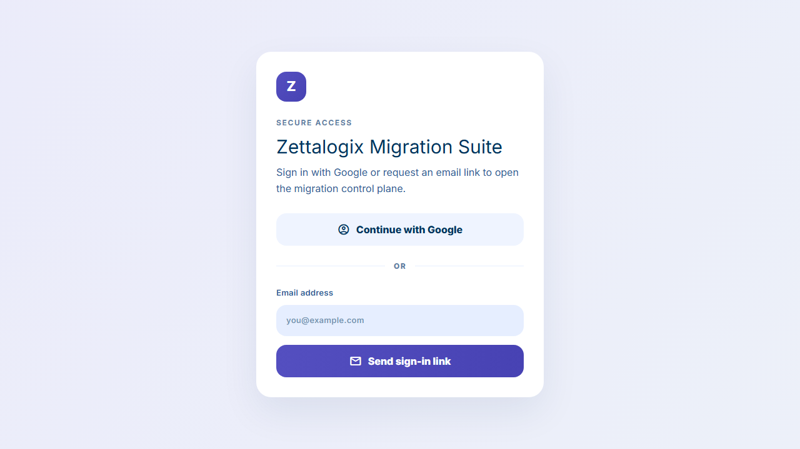

# Zettalogix Migration Suite Frontend

> **Status: Prototype** — The web UI builds successfully. This repository does not contain or claim the external migration backend.

[](docs/demo/demo.webm)

> Watch the verified public frontend overview. The external backend is outside this repository and was not modified.

This repository contains the frontend web UI for Zettalogix Migration Suite.

The backend API and migration worker were split into:

```text
https://github.com/machander-byte/sharepoint_backend.git
```

## What Lives Here

- `ZMS.WebUI`: React/Vite operator UI.
- `ZMS.DesktopApp`: Electron shell for loading the web UI.
- `stitch_zettalogix_migration_interface`: design references.
- `recordings`: walkthrough and test recordings.

The frontend calls the backend through `VITE_API_BASE_URL`. It does not store or execute backend secrets.

## Local Setup

Start the backend API from the backend repository first, usually on `http://localhost:5206`.

Then run the frontend:

```powershell
Set-Location "sharepoint\ZMS.WebUI"
Copy-Item .env.example .env -Force
npm install
npm run dev
```

Open:

```text
http://localhost:5173
```

## Frontend Environment

`ZMS.WebUI/.env` should contain only browser-safe values:

```env
VITE_API_BASE_URL=http://localhost:5206
VITE_GOOGLE_CLIENT_ID=
VITE_GOOGLE_API_KEY=
VITE_GOOGLE_APP_ID=
VITE_GOOGLE_DRIVE_SCOPE=https://www.googleapis.com/auth/drive.readonly
```

Do not put SharePoint client secrets, Google client secrets, Google refresh tokens, database connection strings, or Data Protection paths in this repository.

## Render Deployment

This repo deploys as a static Render service using `render.yaml`.

Set this Render environment variable before building:

```text
VITE_API_BASE_URL=https://your-backend-api-host
```

Because Vite bakes env vars at build time, redeploy the frontend after changing `VITE_API_BASE_URL`.

## Related repositories

- **Web frontend:** `ZMS.WebUI` in this repository.
- **Desktop shell:** `ZMS.DesktopApp` in this repository.
- **Backend/API/workers:** [machander-byte/sharepoint_backend](https://github.com/machander-byte/sharepoint_backend) is referenced by the existing project documentation but is not present locally and was not modified or verified in this audit.

See [docs/TEST_REPORT.md](docs/TEST_REPORT.md) and [docs/demo/DEMO_SCRIPT.md](docs/demo/DEMO_SCRIPT.md).

## License status

No license file is currently present. All rights remain with the copyright holder unless a license is added manually.
