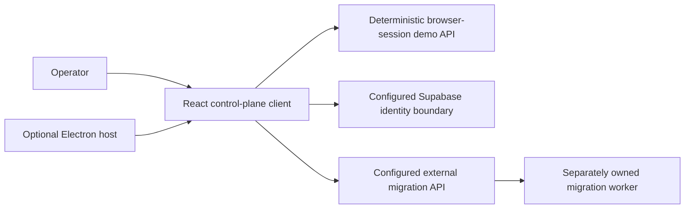

# Architecture

## System view

## Owned boundaries

- **React client:** routing, search, job and connection surfaces, settings, evidence display, and error guidance.
- **Synthetic API:** deterministic in-memory records and reversible state transitions; no network/provider execution.
- **Electron host:** sandboxed renderer, context isolation, no Node integration, and HTTPS-only external window handling.
- **Capture path:** opt-in renderer-only screenshots and frame sequences used for release evidence.

## External boundaries

- Supabase identity and OAuth configuration.
- Migration API, worker execution, persistence, retries, and provider credentials.
- SharePoint, Google Drive, file-share, and Microsoft Entra tenants.

The client never treats external availability as proven by synthetic state. `VITE_API_BASE_URL` and browser-safe public keys are build-time inputs; secrets belong only in the external service boundary.

## Desktop rendering

Web deployments use `BrowserRouter`. `file:` desktop builds use `HashRouter` plus `npm run build:desktop`, which emits relative assets. The repository does not yet ship a signed installer.
