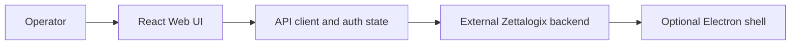

# Zettalogix Migration Suite architecture

Web and Electron frontend for configuring, monitoring, and reviewing content-migration jobs across connected source and destination systems.

## System view

## Component boundaries

- **Operator:** initiates the primary workflow.
- **React Web UI:** owns one stage of the request or interaction flow.
- **API client and auth state:** owns one stage of the request or interaction flow.
- **External Zettalogix backend:** owns one stage of the request or interaction flow.
- **Optional Electron shell:** provides the terminal integration or persistence boundary.

## Runtime and trust boundaries

Only frontend and desktop-shell code are present. The backend is external and was not modified or claimed as included. Inputs crossing a network, filesystem, provider, or database boundary should be validated and logged without sensitive values. Optional integrations must fail clearly rather than being presented as successful.

## Technology

React, TypeScript, Vite, Zustand, Supabase client, Electron.

